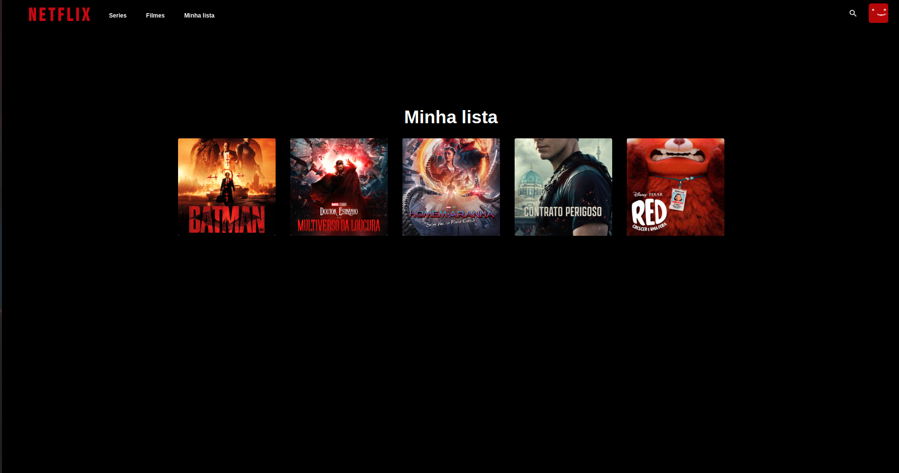

# Netflix UI

Acesse a aplicação em: http://netflix-ui-gamma.vercel.app/

# Descrição

Projeto simulando a interface da aplicação web da Netflix utilizando javascript com React.js, Redux, Hooks e Material-UI.
O objetivo foi fazer uma réplica ( não idêntica ) pondo em prática os conhecimentos de gerenciamento de estado e React.

# Tecnologias utilizadas
- React.js
- Redux
- React Router
- Hooks
- Material-UI

# APIs

The Movie DB: https://developers.themoviedb.org/3/getting-started/introduction

# Demonstração

    
    
    

# Autor

  
  
  
  ---
  
  Versão focada apenas para navegadores não mobile.  
  Status: Em progresso...

